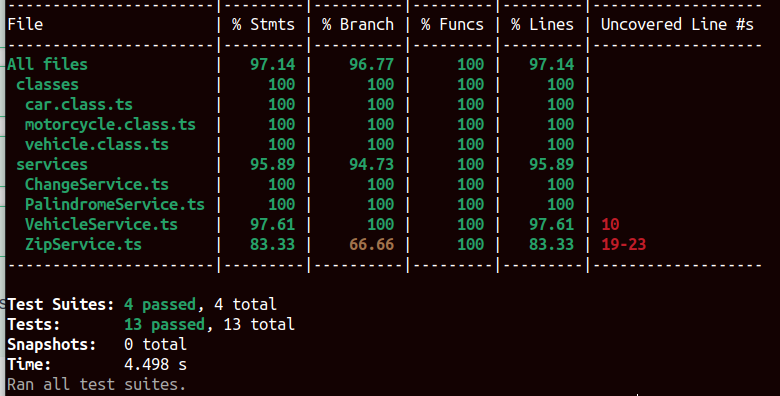

# A-cool-playground

## Como rodar

### Opção 1 - Utilizando docker

- Passo 01: Clone o repositório e entre na pasta raiz do projeto

```
$ git clone https://github.com/arthurarp/A-cool-playground
$ cd A-cool-playground
```

- Passo 02: Digite o seguinte comando no terminal:

```
docker-compose up --build
```

- Passo 03: Para rodar os testes, digite:

```
docker exec -it backend npm run test
```

A documentação se encontra em:
```
 localhost:3000/api-docs
```


### Opção 2 - Padrão

- Passo 01: Clone o repositório e entre na pasta raiz do projeto

```
$ git clone https://github.com/arthurarp/A-cool-playground
$ cd A-cool-playground
```

- Passo 02: Instale as dependências:

```
npm install
```
- Passo 03: Inicie o server:

```
npm run dev
```
- Passo 04: Para rodar os testes, digite:

```
npm run test
```

## Documentação

Ao subir o servidor, a documentação Swagger se encontra em:

```
 localhost:3000/api-docs
```

## Cobertura de testes

